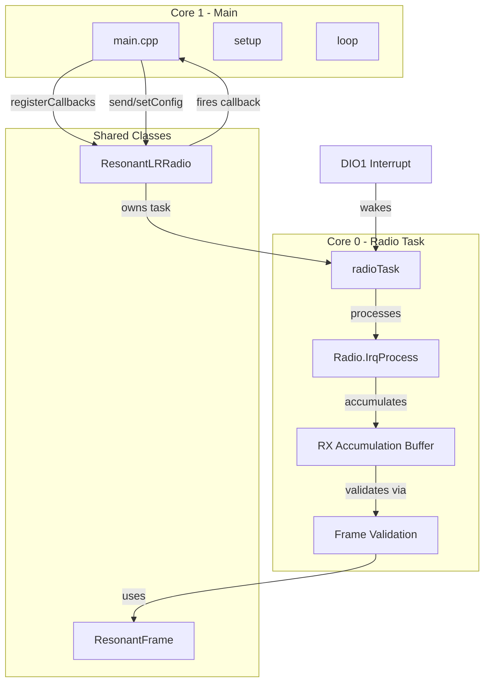

# ResonantLRRadio Architecture Transition Plan

## Architecture Overview



## Key Files to Modify

- Rename `lib/LORA_RADIO/` to `lib/RESONANT_LR_RADIO/`
- Rename `lora_radio.h` to `resonant_lr_radio.h`
- Rename `lora_radio.cpp` to `resonant_lr_radio.cpp`
- Update `src/main.cpp` and `src/main.h`

---

## 1. Radio Configuration System

Create a configuration struct and preset system in [resonant_lr_radio.h](lib/LORA_RADIO/include/lora_radio.h):

```cpp
enum RadioModem {
    MODEM_LORA_MODE,
    MODEM_FSK_MODE
};

struct RadioConfig {
    RadioModem modem = MODEM_LORA_MODE;
    uint32_t frequency = 915600000;
    int8_t txPower = 22;
    
    // LoRa specific
    uint8_t loraBandwidth = 2;      // 0:125k, 1:250k, 2:500k
    uint8_t loraSpreadingFactor = 7;
    uint8_t loraCodingRate = 1;
    uint16_t loraPreambleLength = 8;
    bool loraIqInversion = false;
    
    // FSK specific
    uint32_t fskDatarate = 50000;
    uint32_t fskDeviation = 25000;
    uint32_t fskBandwidth = 125000;
    
    // Common
    uint16_t txTimeout = 5000;
    bool crcOn = true;
};
```

Add preset methods:

```cpp
static RadioConfig getLoRaTelemetryPreset();  // Optimized for small packets
static RadioConfig getFskBulkPreset();        // Optimized for large transfers
```

---

## 2. Callback System

Define callback types for main to register:

```cpp
// Callback when complete RX data is ready (after validation)
typedef void (*RxCompleteCallback)(ValidateFrameResult& result, uint8_t* data, size_t dataLength, int16_t rssi, int8_t snr);

// Callback when TX completes (single or multi-packet)
typedef void (*TxCompleteCallback)(bool success, size_t bytesSent, uint8_t packetCount);

// Callback for errors
typedef void (*ErrorCallback)(uint8_t errorCode, const char* message);
```

---

## 3. ResonantLRRadio Class Interface

New public interface:

```cpp
class ResonantLRRadio {
public:
    // Initialization
    bool init(ResonantFrame* frame);
    bool init(ResonantFrame* frame, const RadioConfig& config);
    
    // Configuration (thread-safe, can be called at runtime)
    void setConfig(const RadioConfig& config);
    RadioConfig getConfig();
    void applyConfig();  // Re-applies current config to radio hardware
    
    // Callbacks
    void onRxComplete(RxCompleteCallback cb);
    void onTxComplete(TxCompleteCallback cb);
    void onError(ErrorCallback cb);
    
    // TX Operations (called from main)
    bool send(uint8_t* data, size_t size);
    bool send(uint8_t* data, size_t size, uint8_t destinationID[4], bool ackRequired);
    
    // RX Operations
    void startRx(uint32_t timeout = 0);
    void stopRx();
    
    // State
    bool isBusy();
    bool isTransmitting();
    bool isReceiving();
    
    // Power management
    void sleep();
    void wake();
    
private:
    // Core 0 task
    static void radioTaskFunc(void* param);
    TaskHandle_t radioTaskHandle = nullptr;
    SemaphoreHandle_t configMutex = nullptr;
    SemaphoreHandle_t txMutex = nullptr;
    
    // RX accumulation for multi-packet
    uint8_t* rxAccumulationBuffer = nullptr;
    size_t rxAccumulatedSize = 0;
    uint8_t rxExpectedPackets = 0;
    uint8_t rxReceivedPackets = 0;
    uint32_t rxSessionTimeout = 5000;
    
    // Internal radio event handlers
    static void internalOnTxDone();
    static void internalOnRxDone(uint8_t* payload, uint16_t size, int16_t rssi, int8_t snr);
    static void internalOnTxTimeout();
    static void internalOnRxTimeout();
    static void internalOnRxError();
};
```

---

## 4. Core 0 Task Implementation

The radio task will be interrupt-driven using DIO1:

```cpp
void ResonantLRRadio::radioTaskFunc(void* param) {
    ResonantLRRadio* radio = (ResonantLRRadio*)param;
    
    while(true) {
        // Wait for DIO1 interrupt notification (or timeout for periodic checks)
        ulTaskNotifyTake(pdTRUE, pdMS_TO_TICKS(100));
        
        // Process radio IRQ
        Radio.IrqProcess();
        
        // Check RX accumulation timeout
        radio->checkRxAccumulationTimeout();
    }
}

// ISR for DIO1 - notifies task
void IRAM_ATTR dio1ISR() {
    BaseType_t xHigherPriorityTaskWoken = pdFALSE;
    vTaskNotifyGiveFromISR(radioTaskHandle, &xHigherPriorityTaskWoken);
    portYIELD_FROM_ISR(xHigherPriorityTaskWoken);
}
```

---

## 5. Multi-Packet RX Accumulation

When packets arrive, accumulate and validate:

```cpp
void ResonantLRRadio::internalOnRxDone(uint8_t* payload, uint16_t size, int16_t rssi, int8_t snr) {
    // Validate frame structure
    ValidateFrameResult result = resonantFrame->validateFrame(payload, size);
    
    if(!result.validChecksum || !result.isIntendedDestination) {
        return; // Discard invalid frames
    }
    
    if(result.frameType == resonantFrame->multiPacketFrameType) {
        // Accumulate multi-packet data
        accumulateMultiPacket(result, rssi, snr);
    } else {
        // Single packet - fire callback immediately
        if(rxCompleteCallback) {
            rxCompleteCallback(result, result.data, result.dataLength, rssi, snr);
        }
    }
}
```

---

## 6. Updated main.cpp Pattern

Main becomes simplified:

```cpp
ResonantLRRadio radio;
ResonantFrame resonantFrame;

// Callbacks
void onDataReceived(ValidateFrameResult& result, uint8_t* data, size_t len, int16_t rssi, int8_t snr) {
    Serial1.printf("Received %d bytes, RSSI: %d\n", len, rssi);
    // Process data...
}

void onTxComplete(bool success, size_t bytes, uint8_t packets) {
    Serial1.printf("TX %s: %d bytes in %d packets\n", success ? "OK" : "FAIL", bytes, packets);
}

void setup() {
    Serial1.begin(115200);
    
    // Load config from NVS/EEPROM
    RadioConfig config = loadConfigFromMemory();
    
    // Initialize radio
    radio.init(&resonantFrame, config);
    
    // Register callbacks
    radio.onRxComplete(onDataReceived);
    radio.onTxComplete(onTxComplete);
    
    // Send telemetry
    uint8_t data[] = {0x01, 0x02, 0x03};
    radio.send(data, sizeof(data));
}

void loop() {
    // Main loop is now simple - radio handles itself on Core 0
    // Only handle application logic here
    
    if(needBulkTransfer) {
        // Switch to FSK for large transfer
        radio.setConfig(ResonantLRRadio::getFskBulkPreset());
        radio.send(largeData, largeDataSize);
        
        // Switch back to LoRa after
        radio.setConfig(ResonantLRRadio::getLoRaTelemetryPreset());
    }
}
```

---

## Thread Safety Considerations

- Use `configMutex` when reading/writing RadioConfig
- Use `txMutex` to prevent concurrent transmissions
- Callbacks fire from Core 0 context - keep them short or use FreeRTOS queues to defer work to Core 1
- Consider adding a `QueueHandle_t` for passing RX data to main if callbacks need to be non-blocking

---

## File Structure After Refactor

```
lib/
  RESONANT_LR_RADIO/
    include/
      resonant_lr_radio.h
    src/
      resonant_lr_radio.cpp
  RESONANT_FRAME/
    (unchanged)
src/
  main.cpp
  main.h
```